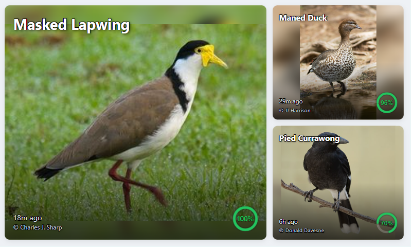
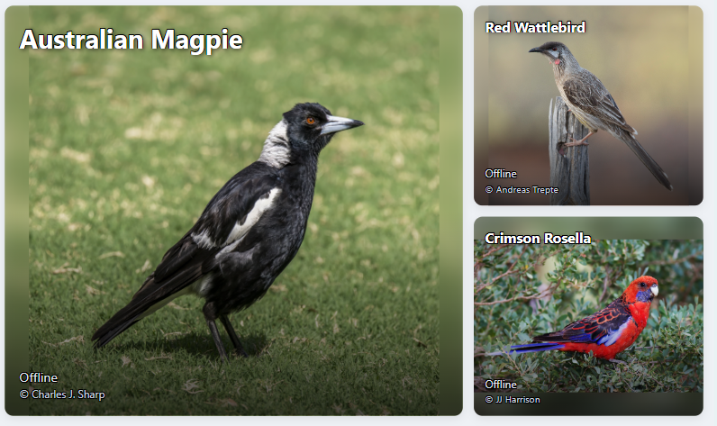

# BirdNET Display


## Screenshots

**Online Mode:**

The online version shows the most recently detected unique birds, each with their confidence value as reported by BirdNET-Pi-Go.



**Offline Mode:**

The offline version displays a random assortment of birds native to the area, using cached images and information.



**QR Code Overlay:**

The interface also displays the IP address of the Pi as a QR code for easy access from other devices.


A Python-based web application designed to run on a Raspberry Pi alongside BirdNET-Pi-Go. It displays the latest 3 bird detections on a screen attached to the Pi, using BirdNET data and local image caches.

## Features
- Designed for Raspberry Pi with a connected display
- Integrates with BirdNET-Pi-Go to show the latest 3 bird detections
- Displays the IP address (including a QR code) of the Raspberry Pi on the webpage
- Displays a list of bird species from a CSV or text file
- Shows cached images and info for each species
- Caches images for all birds in the species list so the app can work completely offline and still display birds
- Simple web interface (see `static/index.html`)
- Easily extensible for new species or image data

## Project Structure
```
bird_species.txt           # List of bird species
species_list.csv           # CSV with species data
birdnet_display.py         # Main Python application
static/
  index.html               # Web UI
  bird_images_cache/       # Cached images and info per species
    <Species_Name>/
      <Species_Name>_1.jpg
      <Species_Name>_1.txt
      ...
```

## Usage
1. Set up a Raspberry Pi with BirdNET-Pi-Go running and a display attached.
2. Install Python 3.x on the Pi.
3. (Optional) Set up a virtual environment.
4. Install the required Python packages:
  ```
  pip install -r requirements.txt
  ```
5. Run the main application:
  ```
  python birdnet_display.py
  ```
6. The latest 3 bird detections will be shown on the connected screen.
7. You can also open `static/index.html` in your browser to view the interface.

## Customization
- Add new species `species_list.csv`
- Place images and info in `static/bird_images_cache/<Species_Name>/`
    - use the common name

## GitHub Repository
[https://github.com/C4KEW4LK/birdnet_display](https://github.com/C4KEW4LK/birdnet_display)

## License
MIT License
